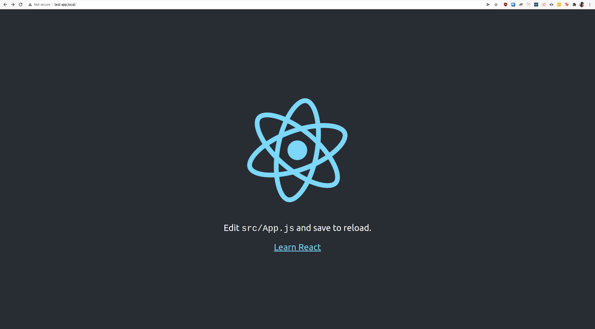
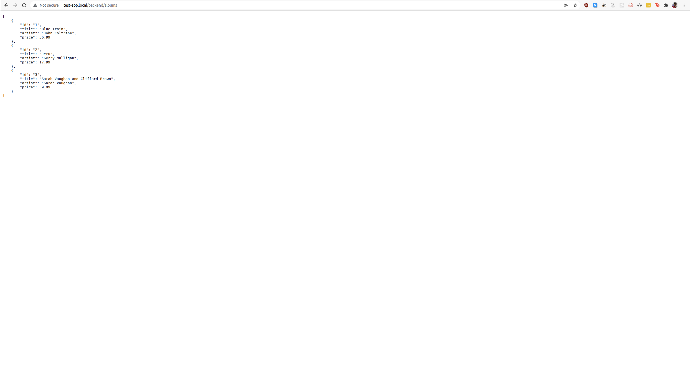

# k8s-learning

A repository created to learn kubernetes concepts.

## Pre-requisites

- Install docker, kubernetes
- Install minikube
- Enable the following addons on minikube
  - `minikube addons enable ingress`
  - `minikube addons enable registry`

## Components in the project

The project contains the following components:
- Frontend - Written in javascript and requires an nginx server
- Backend - Written in go

The frontend and backend are packaged into docker images that are then used in the kubernetes deployment

## K8s Cluster architecture

The K8s cluster has the following configuration
- Single node cluster
- 3 replicas of frontend
- 3 replicas of backend
- 1 LoadBalancer service each for frontend and backend
- 1 nginx Ingress controller configured with dns configured for test-app.local domain

## Detailed description of each component

### Frontend

- Deployment configured to have 3 replicas with labels `app: test-react-app` and `tier: frontend`
- Container image: `localhost:5000/testapp:latest`
- Image created using the frontend [Dockerfile](testapp/Dockerfile)
- nginx server + react app

### Backend

- Deployment configured to have 3 replicas with labels `app: test-backend-app` and `tier: backend`
- Container image: `localhost:5000/testbackend:latest`
- Image created using the backend [Dockerfile](backend/Dockerfile)
- Go + Gin

## How to generate images

- Enable the `registry` addon for minikube by running `minikube addons enable registry`
- Run docker build for either the frontend or backend by running:
    ```shell
    cd testapp
    docker build -t testapp .
    docker tag testapp localhost:5000/testapp
    ```

    ```shell
    cd backend
    docker build -t testbackend .
    docker tag testbackend localhost:5000/testbackend
    ```
- Redirect port 5000 to point to the container registry in the minikube cluster by running the following script in a different terminal
    ```shell
    scripts/registry-port-forward.sh
    ```
    Then, run the following scripts to push the docker images to the container registry
    ```shell
    docker push localhost:5000/testapp
    docker push localhost:5000/testbackend
    ```

## Setup hosts

The host `test-app.local` needs to be added to the system's hosts file.

Get the IP address of the minikube host:
```shell
> minikube ip
192.168.58.2
```

Use this IP to bind it to the `test-app.local` domain

```shell
vi /etc/hosts
```

Add the following line to the hosts file (use the minikube host IP address)
```
192.168.58.2	test-app.local
```

## Run the K8s deployment

At this point, the K8s deployment can be run by running the following:

```
cd deployment
kubectl apply -f test-deployment.yaml
```

- This creates 6 pods for frontend and backend
- `test-app.local/*` will always point to one of the frontend pods depending on availability and load
- `test-app.local/backend/*` will always point to one of the backend pods depending on availability and load - in these requests, the `/backend/` is stripped off and the rest of the path is passed on to the pods

The frontend screenshot at http://test-app.local/


The backend screenshot at http://test-app.local/backend/albums
